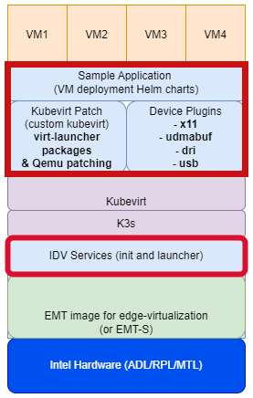

# Desktop Virtualization with Graphics SR-IOV

[](https://opensource.org/licenses/Apache-2.0)
[](https://scorecard.dev/viewer/?uri=github.com/open-edge-platform/edge-desktop-virtualization)
[](https://github.com/open-edge-platform/edge-desktop-virtualization/actions/workflows/github-code-scanning/codeql)
[](https://github.com/open-edge-platform/edge-desktop-virtualization/actions/workflows/device_plugin_coverity.yaml)

- [Desktop Virtualization with Graphics SR-IOV](#desktop-virtualization-with-graphics-sr-iov)
  - [Overview](#overview)
    - [How it works](#how-it-works)
    - [Key Features](#key-features)
    - [System requirements:](#system-requirements)
      - [Recommended Hardware Configuration](#recommended-hardware-configuration)
  - [Enabling Desktop Virtualization with Graphics SR-IOV](#enabling-desktop-virtualization-with-graphics-sr-iov)
    - [Enable Host system with Intel Graphics SR-IOV](#enable-host-system-with-intel-graphics-sr-iov)
      - [Additional Settings](#additional-settings)
    - [K3s/Kubevirt Solution stack for Edge Desktop Virtualization](#k3skubevirt-solution-stack-for-edge-desktop-virtualization)
      - [Installing Kubernetes, Kubevirt and Intel Device Plugin](#installing-kubernetes-kubevirt-and-intel-device-plugin)
    - [Creation of Virtual Machine Bootdisk Image](#creation-of-virtual-machine-bootdisk-image)
    - [Deployment of Virtual Machines](#deployment-of-virtual-machines)
  - [References](#references)
  - [Getting Help](#getting-help)
  - [Contributions](#contributions)
  - [License](#license)

## Overview

Intel's Single Root I/O Virtualization (SR-IOV) for graphics is a technology that allows a single physical Intel graphics processing unit (GPU) to be presented as multiple virtual devices to different virtual machines (VMs). This enables efficient GPU resource sharing and improves performance for graphics-intensive workloads within virtualized environments

### How it works

- The Physical Function (PF) is the full-featured physical function of the GPU, managed by the host OS. 
- Virtual functions (VFs) are created from the PF and assigned to individual VMs.
- Each VF provides a dedicated and isolated path for data transfer to and from the VM, bypassing the host's hypervisor for improved performance and reducded latency.
- PCIe Standard: SR-IOV is a PCI-SIG standard that defines how a single physical PCIe device can be presented as multiple virtual devices. 

<p align="center">

</p>
<p align="center">
<em>Graphics SR-IOV Architecture</em>
</p>

### Key Features

- **Improved performance:** Direct access to the GPU hardware for each VM reduces overhead and latency, particularly for tasks like video transcoding and media processing.
- **Efficient resource utilization:** SR-IOV enables better sharing of GPU resources among multiple VMs, maximizing the utilization of a single physical GPU.
- **Support for cloud-native environments:** SR-IOV is crucial for enabling GPU acceleration in Kubernetes and other cloud platforms.

### System requirements:

SR-IOV for Intel graphics typically requires hardware generation of Alder Lake (12th Gen Intel Core) or newer.
One can check if your Intel graphics controller supports SR-IOV by executing below command for the Single Root I/O Virtualization (SR-IOV) PCI capability
 ```sh
 sudo lspci -s 2.0 -v
 ```


#### Recommended Hardware Configuration

| Component    | Edge Microvisor Toolkit + graphics SR-IOV|
|--------------|------------------------------------------|
| CPU          | Intel® Core (12th gen and higher)        |
| RAM          | 64GB recommended                         |
| Storage      | 500 GB SSD or NVMe minimum               |
| Networking   | 1GbE Ethernet                            |

## Enabling Desktop Virtualization with Graphics SR-IOV 
Steps:
1.  [Enable Host system with Intel Graphics SR-IOV](#enable-host-system-with-intel-graphics-sr-iov)
2.  [Installing Kubernetes, Kubevirt(customized to enable local display for Intel Graphics SR-IOV), Intel Device Plugin](#installing-kubernetes-kubevirt-and-intel-device-plugin)
3.  [Creation of VM bootdisk image](#creation-of-virtual-machine-bootdisk-image)
4.  [Deployment of VMs](#deployment-of-virtual-machines)

### Enable Host system with Intel Graphics SR-IOV

Host OS has to be enabled with graphics SR-IOV ingredients.\
Below are various options (but not limited to) :
- #### [Edge Microvisor Toolkit](https://github.com/open-edge-platform/edge-microvisor-toolkit/tree/3.0)
  - [Creating Intel EMT ISO with Graphics SR-IOV enabled Kernel](https://github.com/open-edge-platform/edge-desktop-virtualization/blob/emt-dv-iso/emt-dv-iso/README.md)
- #### [Debian](https://www.debian.org/distrib/) 
  - [ThunderSoft SR-IOV](docs/common/sriov-host.md#debian-host-system-with-intel-graphics-sr-iov)
- #### [Ubuntu](https://ubuntu.com/download/desktop)
  - [KVM Multi-OS Guide](https://github.com/intel/kvm-multios/blob/main/documentation/setup_sriov.md)
  - [12th Gen Intel® Core™ Processors](docs/common/sriov-host.md#12th-gen-intel-core-mobile-processors-code-named-alder-lake-p--12th-gen-intel-core-desktop-processors-code-named-alder-lake-s-multi-os-with-graphics-sriov-virtualization-on-ubuntu)
  - [13th Gen Intel® Core™ Processors](docs/common/sriov-host.md#13th-gen-intel-core-mobile-processors-for-iot-edge-code-named-raptor-lake---p-multi-os-with-graphics-sr-iov-virtualization-on-ubuntu)
  - [Core Ultra PS Series Intel® Core™ Ultra Processors](docs/common/sriov-host.md#reference-implementation-of-intel-core-ultra-processorintel-core-ultra-processor-ps-series-formerly-known-as-meteor-lake-uhps-multi-os-with-graphics-sr-iov-virtualization-on-ubuntu)

#### Additional Settings
These include creation of service to set Enabling Virtual Functions, Hugepage, USB permissions

1.  [Hugepage Service](docs/common/host-settings.md#setup-hugepages)
2.  [USB Permissions](docs/common/host-settings.md#set-permissions-to-usb-devices)
3.  [Display Settings and GFX Virtual Functions](idv-services/README.md#manual-steps-to-run-idv-service)
    - [Manual Steps](docs/common/host-settings.md#display-setup)

### K3s/Kubevirt Solution stack for Edge Desktop Virtualization

Below are the ingredients to achieve Display and Graphics Virtualization pipeline using SR-IOV.

<p align="center">

</p>
<p align="center">
<em>Desktop Virtualization on K3s/Kubevirt</em>
</p>

The components marked in red are in scope of this solution. 
The display and graphics virtualization pipeline on k3s/kubevirt can be realized by following build and installation of below components.

For detailed documentation refer [Kubevirt patching guide](kubevirt-patch/README.md), [Intel Device-Plugins for Kubernetes](device-plugins-for-kubernetes/README.md), 

#### Installing Kubernetes, Kubevirt and Intel Device Plugin

1. [Install K3S](docs/common/kubevirt-offline-install.md#install-kubernetes)
2. [Install Kubevirt and Intel Device-Plugin](docs/common/kubevirt-offline-install.md#kubevirt-and-intel-device-plugin-installation-using-tar-files)
3. [Install Virt plugin](docs/common/kubevirt-offline-install.md#install-virt-plugin)

### Creation of Virtual Machine Bootdisk Image

1. [Windows Guest VM image creation](sample-application/create-bootdisk/README.md#windows-guest-vm-creation)
2. [Ubuntu Guest VM image creation](sample-application/create-bootdisk/README.md#ubuntu-guest-vm-creation)

### Deployment of Virtual Machines

1. Sample Application : VM deployment Helm charts
   - [Discrete Helm charts](sample-application/discrete/README.md)
   - [Single Helm deployment](sample-application/single/README.md)
2. [Verifying deployment](sample-application/discrete/README.md#6-running-webgl-aquarium-test)

## References
- [Reference-1](https://cyberus-technology.de/en/articles/vbox-kvm-sriov)
- [Reference-2](https://www.dfi.com/Uploads/DownloadCenter/5631e304-28b2-4256-975a-5689750b5636/Intel%20iGPU%20(Integrated%20Graphics)%20SR-IOV%20-%20The%20Catalyst%20for%20IoT%20Virtualization%20in%20Factory%20Automation.pdf?timestamp=1676441838.9072)
- [Reference-3](https://www.intel.com/content/www/us/en/secure/content-details/782115/intelligent-desktop-virtualization-idv.html?wapkw=intelligent%20desktop%20virtualization&DocID=782115)
- [Reference-4](https://www.intel.com/content/www/us/en/secure/content-details/657261/sr-iov-based-graphics-virtualization.html?wapkw=intelligent%20desktop%20virtualization&DocID=657261)
- [Reference-5](https://github.com/intel/kubevirt-gfx-sriov)
- [Reference-6](https://dgpu-docs.intel.com/devices/hardware-table.html)

## Getting Help

if you encounter bugs, have feature requests, or need assistance, [file a Github issue](https://github.com/open-edge-platform/edge-desktop-virtualization/issues)

For security-related concerns, please refer to [SECURITY.md](./SECURITY.md).

## Contributions

Edge Desktop Virtualization is open source and always welcomes an active community to support adding new features, optimizing, and improving security.

To learn how to contribute to the project, see the [Contributor's Guide](./CONTRIBUTING.md).

## License

For license related information refer [LICENSES](./LICENSES/)

Last Updated Date: June 02, 2025
